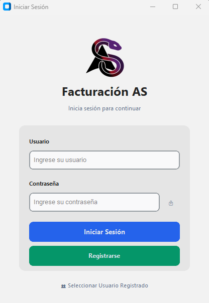
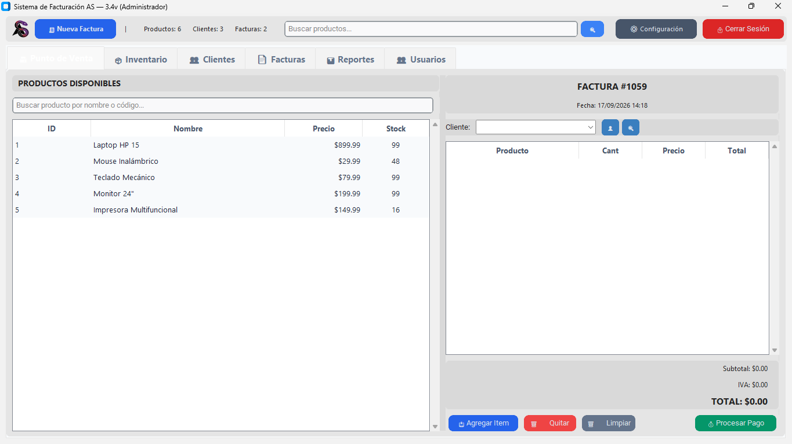

<!-- markdownlint-disable MD033 -->
<p align="center">
  
</p>

<h1 align="center">🧾 Sistema de facturación AS  — v3.3</h1>

<p align="center">
  <strong>Sistema de facturación de escritorio moderno, rápido y seguro</strong><br>
  Gestión de ventas, inventario, clientes y reportes con interfaz gráfica elegante.
</p>

<p align="center">
  <a href="https://github.com/AndreDev66/AS-Facturation-Workspace/blob/main/LICENSE"></a>
  <a href="https://www.python.org/downloads/"></a>
  <a href="https://github.com/AndreDev66/AS-Facturation-Workspace"></a>
  
</p>

---

## 📖 Descripción

**AS Facturation** es una aplicación de escritorio diseñada para pequeñas y medianas empresas. Centraliza la facturación, el control de stock, la base de clientes y la generación de reportes en una herramienta amigable y totalmente funcional sin necesidad de conexión a internet.

### 🧠 ¿Por qué elegir AS Facturation?

- ✅ **Sin suscripciones** – Una sola instalación, datos locales.
- ✅ **Interfaz moderna** – Construida con `CustomTkinter` (tema claro/oscuro).
- ✅ **Persistencia segura** – SQLite + respaldo automático en JSON.
- ✅ **Roles integrados** – `admin` (control total) y `empleado` (solo ventas y consultas).
- ✅ **Reportes visuales** – Gráficos de ventas, productos más vendidos y evolución mensual.

---

## ✨ Características principales

| Módulo | Funcionalidades |
|--------|----------------|
| 🛒 **Punto de venta** | Búsqueda rápida de productos, carrito, cálculo automático de impuestos y totales. |
| 📦 **Inventario** | Alta, edición, eliminación, control de stock mínimo y alertas. |
| 👥 **Clientes** | Registro con campos ampliados (teléfono, email, dirección, crédito disponible). |
| 🧾 **Facturación** | Creación, edición, anulación y seguimiento de estado (pagada / crédito). |
| 💰 **Pagos y créditos** | Registro de abonos, control de saldo pendiente y generación de recordatorios. |
| 📊 **Reportes** | Ventas por período, productos más vendidos, clientes frecuentes, exportación a Excel. |
| 🔐 **Seguridad** | Login con roles, hash de contraseñas (próximamente), respaldos automáticos. |

---

## 🖥️ Capturas de pantalla

> *Imagenes demostrativas:*

<p align="center">
  
  &nbsp;&nbsp;&nbsp;
  
</p>
<p align="center"><i>Pantalla de login y ventana principal de facturación.</i></p>

---

## 🏗️ Estructura del proyecto

- `Main.py` — archivo principal que arranca la aplicación, muestra pantalla de splash y login.
- `db.py` — módulo de base de datos, inicializa tablas SQLite y gestiona el estado.
- `requirements.txt` — dependencias Python.
- `billing_data.json` — respaldo de datos generado por la aplicación.
- `Excel/` — carpeta de exportaciones o reportes Excel.
- `img/` — recursos de imágenes y logos.
- `test_create_user.py`, `test_login_ui.py` — pruebas de UI/usuario.

---

## ⚙️ Requisitos

- Python 3.10+ recomendado
- Windows (probado en este entorno)

Dependencias principales:
- `customtkinter`
- `matplotlib`
- `Pillow`
- `openpyxl` (opcional, para exportar a Excel)

---

## 💻 Instalación

1. Abre una terminal en la carpeta del proyecto.
2. Crea un entorno virtual (recomendado):

```bash
python -m venv .venv
```

3. Activa el entorno virtual:

```powershell
.\.venv\Scripts\Activate.ps1
```

4. Instala dependencias:

```bash
pip install -r requirements.txt
```

> Si `openpyxl` no está en `requirements.txt`, puedes instalarlo por separado:
>
> ```bash
> pip install openpyxl
> ```

---

## ▶️ Ejecución

Ejecuta la aplicación desde la terminal:

```bash
python Main.py
```

El proyecto abre una ventana de login/splash y luego carga el sistema de facturación.

---

## 🔐 Credenciales iniciales

La base de datos inicial crea un usuario administrador por defecto:

- Usuario: `admin`
- Contraseña: `admin`

> Se recomienda cambiar estas credenciales en el primer inicio.

---

## 📝 Notas importantes

- Los datos se almacenan en `billing.db` y se respaldan en `billing_data.json`.
- Si la app detecta una base de datos vacía, intenta restaurar desde el JSON de respaldo.
- La app incluye migraciones de esquema para mantener compatibilidad con versiones anteriores.
- El diseño permite que el rol `empleado` tenga acceso restringido a edición/eliminación de recursos.

---

## 📌 Mejores prácticas

- Haz respaldos periódicos de `billing.db` y `billing_data.json`.
- Usa la carpeta `Excel/` para guardar reportes exportados.
- Si usas iconos o logos personalizados, colócalos en `img/`.

---

## 🌟 Extensiones posibles

- Exportar facturas en PDF
- Integrar impresión directa de tickets
- Conexión a servicios de cotización de moneda en tiempo real
- Añadir control de usuarios y permisos más granular

---

## 📚 Referencias rápidas

- Archivo principal: `Main.py`
- Datos persistentes: `db.py`
- Respaldo JSON: `billing_data.json`
- Dependencias: `requirements.txt`

---

